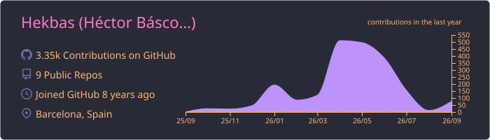
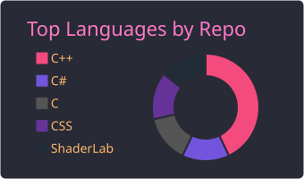

Hi, I'm ~~Hekbas~~ Héctor!
I'm a programmer with a deep passion for **Game Engine Development** and **Computer Graphics**. I specialize in C++ and love diving into the low-level details of high-performance systems, custom renderers, and editor tooling.

`C++20` `Vulkan` `Unity` `HLSL/GLSL` `Tooling`

  <picture>
    <source media="(prefers-color-scheme: dark)" srcset="./profile-summary-card-output/github_dark/3-stats.svg">
    <source media="(prefers-color-scheme: light)" srcset="./profile-summary-card-output/github/3-stats.svg">
    
  </picture>&nbsp;<picture>
    <source media="(prefers-color-scheme: dark)" srcset="./profile-summary-card-output/github_dark/1-repos-per-language.svg">
    <source media="(prefers-color-scheme: light)" srcset="./profile-summary-card-output/github/1-repos-per-language.svg">
    
  </picture>

---

### Featured Projects

1. **[Luth Engine](https://github.com/Hekbas/Luth)** *(C++20, Vulkan)*  
A data-oriented engine built from scratch for my bachelor thesis. It features a lock-free fiber-based job system, a Vulkan 1.3 render graph with dynamic rendering, and a custom ImGui-based editor. 

2. **KONVOY** *(Unity, URP, HLSL)*  
An unannounced Indie Title I am building alongside a small team. My primary role involves developing procedural world generation tools, custom tessellation, and post-processing shaders.

3. **[TheOneEngine](https://github.com/Shadow-Wizard-Games/TheOneEngine)** *(C++, OpenGL)*  
My early exploration into engine architecture, featuring a custom OpenGL renderer.
